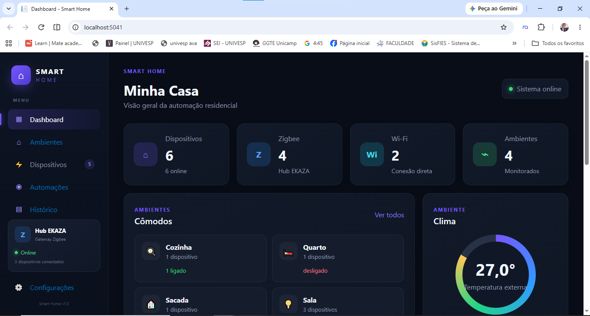

# 🏠 SmartHomeDashboard

Sistema web para gerenciamento e monitoramento de dispositivos de automação residencial, desenvolvido como projeto de estudo e portfólio.

## 🖥️ Demonstração

## 📌 Sobre o projeto

O SmartHomeDashboard é uma aplicação web desenvolvida para simular o gerenciamento e monitoramento de dispositivos de uma residência inteligente.

A aplicação utiliza ASP.NET Core MVC para a estrutura web, Entity Framework Core para acesso e persistência de dados e SQL Server como banco de dados.

O sistema permite gerenciar dispositivos por meio de operações CRUD e também consome uma API externa de clima utilizando HttpClient, exibindo informações como temperatura e umidade no Dashboard.

## 🚀 Tecnologias utilizadas

- C#
- ASP.NET Core MVC
- Entity Framework Core
- SQL Server
- HTML
- CSS
- Bootstrap
- Razor Views
- API REST
- Open-Meteo API

## 📋 Funcionalidades

- Dashboard de automação residencial
- Cadastro de dispositivos
- Consulta de dispositivos cadastrados
- Edição de dispositivos
- Exclusão de dispositivos
- Monitoramento de dispositivos Online/Offline
- Organização dos dispositivos por cômodo
- Suporte a dispositivos Wi-Fi e Zigbee
- Registro da última comunicação do dispositivo
- Integração com API externa para informações climáticas

## 🗄️ Banco de Dados

O projeto utiliza SQL Server com Entity Framework Core para realizar a comunicação entre a aplicação e o banco de dados.

Arquitetura simplificada:

ASP.NET Core MVC → Entity Framework Core → SQL Server

O Entity Framework Core é responsável pelo mapeamento das entidades C# para as tabelas do banco de dados.

## 🔄 CRUD

O sistema possui as principais operações de banco de dados:

- Create — cadastrar dispositivos
- Read — consultar dispositivos
- Update — editar dispositivos
- Delete — excluir dispositivos

## 🌦️ API de Clima

O dashboard possui integração com a Open-Meteo API utilizando HttpClient para obter informações climáticas.

Entre os dados utilizados estão:

- Temperatura
- Umidade relativa do ar

## 🏗️ Estrutura do projeto

Controllers — controle das requisições e regras de navegação

Models — representação das entidades da aplicação

Data — configuração do Entity Framework e acesso ao banco

Services — serviços e integrações externas

Views — páginas Razor da aplicação

Migrations — controle da estrutura do banco de dados

wwwroot — arquivos CSS, JavaScript e recursos estáticos

## 🎯 Objetivo

Este projeto foi desenvolvido com o objetivo de aplicar conhecimentos de desenvolvimento web com C#, ASP.NET Core MVC, Entity Framework Core, SQL Server e integração com APIs.

O projeto também faz parte do meu portfólio de desenvolvimento de software.